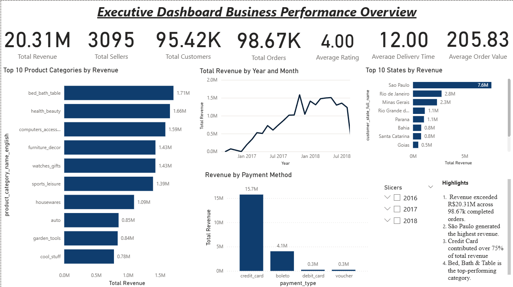

# Olist E-Commerce Data Analysis

This project is a data analyst portfolio notebook built on the Olist Brazilian e-commerce datasets. It focuses on cleaning raw multi-table data, translating Portuguese business labels into English, standardizing location fields, joining the tables into an analysis-ready dataset, and producing charts that can be used in a portfolio or dashboard.

## Dataset Source

The dataset used in this project is available on Kaggle:

- https://www.kaggle.com/datasets/olistbr/brazilian-ecommerce/data

Anyone who wants to reproduce, extend, or compare results can use that source together with the notebook in this repository.

## Frameworks and Tools Used

- Python - main programming language for the project.
- Jupyter Notebook - interactive environment for step-by-step analysis.
- pandas - data loading, cleaning, merging, transformation, and export.
- NumPy - numerical support and array-based operations.
- Seaborn - statistical plotting and clean visualizations.
- Matplotlib - chart layout and base visualization control.
- Power BI - recommended downstream tool for maps, KPI dashboards, and heatmaps using the exported files.

## Why this project exists

The goal is to show a complete analyst workflow, not just a set of charts. The project aims to turn a real-world relational e-commerce dataset into a clean and readable analytics asset that is easy to explain in interviews and easy to reuse in BI tools. A strong portfolio project should demonstrate that you can:

- Load messy raw data from multiple CSV files.
- Clean and standardize it using pandas and NumPy.
- Translate business labels into readable English.
- Turn abbreviated location codes into readable full names.
- Merge related tables correctly using relational keys.
- Create useful business metrics.
- Visualize insights clearly with seaborn and matplotlib.
- Export cleaned data for reuse in Power BI or other BI tools.

## What We Were Aiming For

The main objective was to build a practical end-to-end analysis project that shows both technical skill and business thinking. Specifically, the notebook was designed to:

- make the raw Olist data easier to understand,
- translate Portuguese labels into English for a wider audience,
- replace abbreviated state codes with full state names,
- create one analysis-ready dataset from multiple source tables,
- produce KPIs and charts that tell a business story,
- keep geolocation latitude and longitude available for mapping and heatmap work in Power BI.

In short, the project is meant to show that the data can be cleaned, explained, analyzed, and reused in a dashboard-ready format.

## Project files

- [olist_ecommerce_data_analysis.ipynb](olist_ecommerce_data_analysis.ipynb) - main notebook with the full cleaning and analysis workflow.
- [outputs/olist_cleaned_analysis_ready.csv](outputs/olist_cleaned_analysis_ready.csv) - merged, cleaned analysis table.
- [outputs/olist_geolocation_cleaned.csv](outputs/olist_geolocation_cleaned.csv) - cleaned geolocation table with latitude and longitude for mapping.
- [olist_dataset/](olist_dataset) - raw source CSV files.
- [dataDirectory.md](dataDirectory.md) - quick reference to the dataset tables and relationships.

## Dataset overview

The Olist dataset is a relational e-commerce dataset. Different CSV files represent different business tables.

### Main tables

- `olist_orders_dataset.csv` - order lifecycle data such as status and timestamps.
- `olist_customers_dataset.csv` - customer identity and location data.
- `olist_order_items_dataset.csv` - item-level order details such as product, seller, price, and freight.
- `olist_order_payments_dataset.csv` - payment method and payment values.
- `olist_order_reviews_dataset.csv` - review score and customer feedback.
- `olist_products_dataset.csv` - product metadata and dimensions.
- `olist_sellers_dataset.csv` - seller identity and location data.
- `olist_geolocation_dataset.csv` - zip code, city, state, and coordinates.
- `product_category_name_translation.csv` - Portuguese-to-English category mapping.

## Why the notebook uses these libraries

### NumPy
NumPy is used for numeric and array-style operations when cleaning and preparing data. It is a standard foundation for numerical analysis in Python and pairs naturally with pandas.

### Pandas
Pandas is the core tool in the project. It is used for:

- Reading CSV files.
- Inspecting schemas and missing values.
- Removing duplicates.
- Converting timestamps and numeric columns.
- Merging tables.
- Creating summary metrics.
- Exporting cleaned outputs.

### Seaborn
Seaborn is used for statistical visualizations. It makes it easy to create clean, readable charts with good defaults for business analysis.

### Matplotlib
Matplotlib is used as the base plotting library and for figure layout control. It gives full control over chart sizing, labels, and subplot arrangement.

## Cleaning workflow and why each step was used

### 1. Load all source tables
The notebook loads every CSV separately because the Olist dataset is normalized. Each file contains a different part of the business process, so reading them individually preserves the relationships between orders, products, customers, sellers, reviews, and payments.

### 2. Inspect structure and quality
Before cleaning, the notebook checks:

- column names,
- data types,
- missing values,
- duplicate rows,
- sample records.

This is important because it confirms what needs to be cleaned before merging tables.

### 3. Standardize text fields
Text columns are stripped of extra whitespace so joins and comparisons are more reliable.

### 4. Remove duplicates
Duplicate rows are dropped from each table to prevent inflated counts and duplicate joins.

### 5. Convert timestamps
Order, shipping, and review date columns are converted to datetime types so delivery timing, approval delays, and trend analysis can be calculated correctly.

### 6. Convert numeric fields
Price, freight, payment, and product dimension columns are converted to numeric types so they can be aggregated and used in metrics.

### 7. Fix obvious column typos
The product table contains misspelled field names such as:

- `product_name_lenght`
- `product_description_lenght`

These are renamed to:

- `product_name_length`
- `product_description_length`

This makes the dataset cleaner and easier to explain in a portfolio or interview.

### 8. Translate Portuguese categories to English
The category translation file is merged into the products table so category labels become business-friendly English values. This is critical for readability and for presenting the project to a wider audience.

### 9. Expand state abbreviations
Brazilian state abbreviations such as `SP`, `RJ`, and `MG` are expanded into full names like `Sao Paulo`, `Rio de Janeiro`, and `Minas Gerais`.

This makes the output easier to understand in dashboards, maps, and portfolio screenshots.

### 10. Merge tables into an analysis-ready dataset
The notebook joins the tables using the correct relational keys:

- orders joined to customers by `customer_id`
- order items joined to orders by `order_id`
- products joined by `product_id`
- sellers joined by `seller_id`
- payments summarized by `order_id`
- reviews summarized by `order_id`

This creates one wide analysis table that is suitable for reporting and visualization.

### 11. Create summary metrics and features
The notebook engineers business features such as:

- delivery time in days,
- approval time in hours,
- delivery delay,
- shipping time,
- order month,
- weekday of purchase,
- delayed order flag,
- order value per item,
- review category bands.

These features make the analysis more meaningful than raw transactional data alone.

### 12. Visualize trends
The notebook creates charts for:

- order status KPI summary,
- monthly order volume,
- top customer states by orders,
- top product categories by revenue,
- delivery time distribution,
- customer review KPI.

These are intended to demonstrate storytelling, not just technical cleaning.

### 13. Export cleaned datasets
The notebook exports two files:

- a cleaned, merged analysis table,
- a separate geolocation file with latitude and longitude.

The geolocation file is especially useful for Power BI map or heatmap visuals.

## Why the outputs are useful

### Cleaned analysis table
The main export is useful for:

- Power BI dashboards,
- Excel analysis,
- SQL-style reporting,
- follow-up statistical analysis,
- portfolio screenshots and storytelling.

### Geolocation table
The geolocation export keeps the latitude and longitude fields available for map-based analysis in Power BI. It can be used for:

- bubble maps,
- heatmaps,
- regional distribution views,
- customer concentration analysis.

 - we were not able to add the map visualization in the notebook itself because seaborn and matplotlib do not support geospatial mapping. The exported geolocation table was intended to be used in Power BI but due to security restrictions we weren't allowed to include map visuals in power Bi.

## How to run the notebook

1. Open [olist_ecommerce_data_analysis.ipynb](olist_ecommerce_data_analysis.ipynb).
2. Make sure the `olist_dataset` folder is in the project root.
3. Run the cells from top to bottom.
4. The cleaned output files will be written to the `outputs` folder.

## Power BI Snippets

The exported CSV files are designed to be reused in Power BI. A few practical ways to build on them are:

- KPI cards for total orders, delivered orders, canceled orders, and total revenue.
- Bar charts for top product categories by revenue and top customer states by order count.
- Line charts for monthly order volume using the translated month labels.
- Map or heatmap visuals using `geolocation_lat` and `geolocation_lng` from the geolocation export.
- Delivery performance visuals based on `delivery_time_days` and `delivery_delay_days`.
- Review analysis charts using the `review_category` field.

- Please check out Power BI's work  which is located in the repo under the folder name "powerbi" 

Example Power BI measures you could create from the cleaned data:

- Total Orders = `COUNTROWS(olist_cleaned_analysis_ready)`
- Total Revenue = `SUM(olist_cleaned_analysis_ready[total_payment_value])`
- Average Delivery Time = `AVERAGE(olist_cleaned_analysis_ready[delivery_time_days])`
- Late Delivery Rate = `DIVIDE(CALCULATE(COUNTROWS(olist_cleaned_analysis_ready), olist_cleaned_analysis_ready[is_delayed] = TRUE()), COUNTROWS(olist_cleaned_analysis_ready))`

These snippets help turn the project into a dashboard-ready business report rather than only a notebook analysis.

## Notes for portfolio use

If you want to present this project in interviews or on GitHub, focus on these points:

- You handled a relational real-world dataset.
- You translated and standardized labels for business readability.
- You cleaned and merged data carefully instead of jumping straight to charts.
- You created analysis-ready outputs for BI use.
- You produced metrics that tell a business story about orders, reviews, and delivery performance.

## Suggested portfolio narrative

This project analyzes Olist e-commerce order behavior, customer geography, product performance, and delivery quality. The raw relational data was cleaned with pandas and NumPy, translated from Portuguese to English, standardized with full state names, merged into a single analytics table, and visualized with seaborn and matplotlib. The final outputs are ready for use in Power BI and other reporting tools.

## Data disclaimer

The project uses publicly available Olist data. Some original labels remain in normalized business form where they are already English-friendly or part of the original dataset naming convention.

## Disclaimer
This project is for educational purposes only. The author is not affiliated with Olist or any of its subsidiaries. The dataset is publicly available on Kaggle, and the analysis is intended to demonstrate data cleaning, merging, and visualization techniques.

## Made with ❤️  by [(Veeraditya Sutagatti)](https://github.com/06veer)